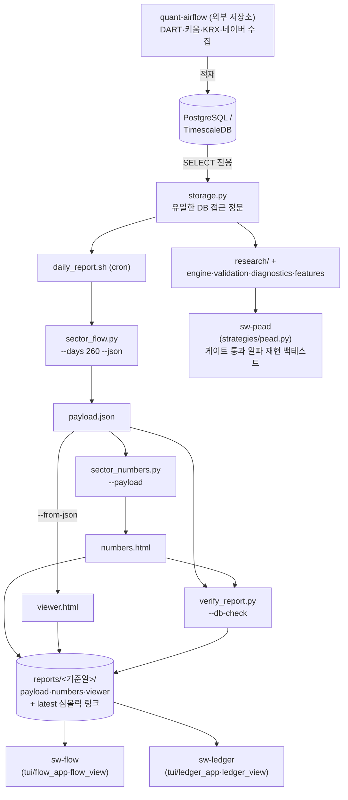

# swing-it

[](https://github.com/younghwan91/swing-it/actions/workflows/ci.yml)
[](LICENSE)
[](https://www.linkedin.com/in/younghwan-chae/)

**한국 주식(KOSPI·KOSDAQ) 리서치 저장소.** 매일의 주체별 순매매를 섹터 단위로 재서
터미널에서 보는 kqflow 가 이 저장소의 주 화면이고, 그 옆에 가설을 개별 트레이드
분포로 심사하는 알파 심사 프레임워크가 있다.

두 축의 성격은 다르다. 관측은 지금 무슨 일이 일어났는가만 재고 심사는 이 신호가
미래 수익을 예측하는가를 묻는다. kqflow 의 모든 지표는 측정값이고 동시기(同時期)다.
돈이 들어온 섹터가 앞으로 오른다는 주장이 아니다([§6](#6-주의--이-숫자들은-예측이-아니다)).

> **데이터 수집은 이 저장소에 없다.** 수집 로직(DART·키움·KRX·네이버 커넥터,
> TimescaleDB 적재)은 [quant-airflow](https://github.com/younghwan91/quant-airflow)로
> 분리되어 있다. 본 저장소는 DB를 읽기 전용으로 사용한다.

## 목차

1. [kqflow — 무엇을 보여주나](#1-kqflow--무엇을-보여주나)
2. [설치와 실행](#2-설치와-실행)
   · [데이터는 어떻게 받나](#23-데이터는-어떻게-받나--리포트-폴더를-그대로-주고받는다) — DB 없이 리포트 폴더만 받아서 보는 법
   · [아키텍처 한눈에](#24-아키텍처-한눈에) — quant-airflow ↔ DB ↔ 리포트 ↔ 화면
3. [화면 읽는 법](#3-화면-읽는-법)
   · [종목 선정 가이드](docs/trading-guide.md) — 섹터에서 종목까지 3단계, 실제 예제
4. [자금 원장 — `sw-ledger`](#4-자금-원장--sw-ledger)
5. [숫자의 정의](#5-숫자의-정의)
6. [주의 — 이 숫자들은 예측이 아니다](#6-주의--이-숫자들은-예측이-아니다)
7. [리포트를 스스로 검증한다](#7-리포트를-스스로-검증한다)
8. [알파 심사 프레임워크](#8-알파-심사-프레임워크)
9. [저장소 구조와 개발](#9-저장소-구조와-개발)
10. [관련 프로젝트](#10-관련-프로젝트)

---

## 1. kqflow — 무엇을 보여주나

`sw-flow` 는 오늘 어느 섹터에 돈이 들어오고 나갔는지를 한 화면에 놓는다. 27개 벤더
섹터 × 4개 구간(5·20·60·120거래일)과 이를 요약하는 `종합` × 3개 시장(전체·거래소·코스닥)
× 4개 주체(기관·외국인·개인·기타법인)를 키 하나로 갈아 끼운다.

<!-- SCREENSHOT: 기본 20일 화면 (120×30) -->


*기본 화면(20거래일·전체 시장·기관, 120×30). 한 행이 한 섹터이고 가속 내림차순이다.
폭 120 에는 여기까지 들어간다. 순매수·순매도 상위는 125칸부터 나온다(§3.2).*

금액만 보면 대형 섹터가 늘 이긴다. 그래서 기본 정렬은 **가속**(구간 누적 순매수 ÷ 섹터
시총)이다. 규모로 정규화한 유입이라 삼성전자가 있는 섹터가 자동으로 1등이 되지 않는다.

`Enter` 를 누르면 그 섹터의 전 종목이 금액순으로 펼쳐진다. 섹터 합계가 어느 종목에서
나왔는지 그 자리에서 보인다. 실측상 전기/전자 386종목 중 7개가 그 섹터 흐름의 80%를
설명한다.

<!-- SCREENSHOT: Enter 드릴다운 종목 목록 (120×30) -->


*`Enter` 드릴다운(전기/전자, 20일). 누적[%] 열의 `-` 마커 위쪽 7개가 그 섹터를 실제로
움직인 종목이다. 386종목의 나머지는 스크롤할 0 이다.*

DB 에 접속하지 않는다. 일일 배치가 만들어 둔 리포트 JSON 만 읽으므로 SSH 에서 즉시 뜨고
화면과 HTML 표가 같은 숫자를 본다.

## 2. 설치와 실행

**요구사항:** Python 3.11 이상, [uv](https://docs.astral.sh/uv/). DB 없이 화면만 보려면
(§2.3) 이걸로 끝이고, 리포트를 직접 만들려면(§2.1) PostgreSQL/TimescaleDB 접속정보가
추가로 필요하다.

```bash
git clone https://github.com/younghwan91/swing-it
cd swing-it
uv venv && uv pip install -e ".[viz,dev]"     # TimescaleDB 를 쓰면 pg extra 를 더한다
cp .env.example .env                          # KR_QUANT_DB 접속정보 (비우면 로컬 SQLite)
```

### 2.1 리포트 만들기 (DB 필요)

화면은 리포트를 읽을 뿐이라 먼저 리포트가 있어야 한다. 배치 한 줄이 전부다.

```bash
scripts/daily_report.sh
```

폴더 이름에 붙는 것은 데이터 기준일(`supply_demand` 의 `MAX(date)`)이다. 실행한 날짜와는
상관없다. 휴장일에 돌면 이미 있는 폴더를 보고 건너뛴다. 기본 출력 위치는
`<저장소>/reports/<기준일>` 이고 `latest` 심볼릭 링크가 따라 움직인다(`KR_QUANT_REPORTS`
로 바꾼다). 생성물이지 소스가 아니므로 `.gitignore` 로 git 추적 대상에서는 뺐다. cron 에
그대로 건다.

**리포트 형식이 바뀌면 그 건너뛰기가 발목을 잡는다.** 폴더가 이미 있으면 배치는 조용히
넘어가므로 열이 새로 생겨도 다음 거래일까지 옛 리포트가 그대로 뜬다. 화면에서는 새 열
넷이 통째로 `—` 인 빈 칸으로 보인다(종목 목록 제목에 `옛 리포트(새 열 없음)` 가 뜬다).
그럴 때 문을 여는 것이 `KR_QUANT_FORCE` 다.

```bash
KR_QUANT_FORCE=1 scripts/daily_report.sh     # 같은 기준일이어도 다시 만든다 (약 5~6분)
```

옆에 새로 지어 마지막에 바꿔 끼우므로 도중에 실패하면 옛 리포트가 그대로 남는다.

배치가 하는 일을 손으로 풀면 이렇다.

```bash
uv run python scripts/sector_flow.py    --days 260 --json payload.json
uv run python scripts/sector_flow.py    --from-json payload.json --html viewer.html
uv run python scripts/sector_numbers.py --payload payload.json --html numbers.html
uv run python scripts/verify_report.py  --dir <리포트폴더> --db-check
```

페이로드는 한 번만 만들고 수치표·뷰어가 그것을 공유한다. 화면과 표가 같은 숫자를
보게 하려는 것이기도 하고, 월별 시총 계산이 한 번에 수 분 걸리기 때문이기도 하다.

### 2.2 화면 띄우기 (DB 불요)

```bash
sw-flow                          # <저장소>/reports/latest 를 연다
sw-flow --dir <리포트 폴더>       # 특정 날짜의 리포트
sw-ledger                        # 자금 원장 (§4)
sw-ledger --dump --width 100     # 색 없는 평문 — 파이프·리다이렉트용
```

표준 라이브러리 `curses` 만 쓴다. 새 의존성이 없고 40×10 짜리 창에서도 산다. 폭이
모자라면 열이 경계에서 통째로 빠진다(숫자가 자릿수 중간에서 잘려 다른 값처럼 보이지
않게). 원장 표만은 예외다. 71칸 미만이면 아예 안 그리고 그 사실을 적는다. 4주체와
잔여가 한 덩어리라 일부만 보여주면 회계 항등식이 깨진 것처럼 읽힌다. `NO_COLOR` 를
존중한다.

### 2.3 데이터는 어떻게 받나 — 리포트 폴더를 그대로 주고받는다

**받는 쪽에는 DB 도 수집 파이프라인도 필요 없다.** 화면 둘은 리포트 폴더의 파일만 읽는다
(§2.2). 그래서 데이터는 계정이나 접속정보 없이 폴더 하나 단위로 오간다.

만드는 쪽(DB 를 가진 사람)이 `scripts/daily_report.sh` 로 폴더를 만들고 그 폴더를 보낸다.

```bash
# 보내는 쪽 — 폴더째 압축 (2026-09-01 기준 약 1.9 MB)
tar czf swing-it-2026-09-01.tar.gz -C <저장소>/reports 2026-09-01

# 받는 쪽 — 풀고 --dir 로 연다. 설치는 clone + uv pip install -e . 까지만 하면 된다
tar xzf swing-it-2026-09-01.tar.gz -C ~/reports
sw-flow   --dir ~/reports/2026-09-01
sw-ledger --dir ~/reports/2026-09-01
```

어떤 화면이 어떤 파일을 읽는지는 다르다. 하나만 보내면 다른 하나가 안 뜬다.

| 파일 | 크기 | 없으면 |
|---|---|---|
| `numbers.html` | 2.0 MB | `sw-flow` 가 안 뜬다 (`리포트를 찾을 수 없다`). 브라우저로 열면 수치표 자체가 된다 |
| `payload.json` | 2.9 MB | `sw-ledger` 가 안 뜬다 (`페이로드를 찾을 수 없다`) |
| `viewer.html` | 2.9 MB | 브라우저용 차트 뷰어. 터미널 화면 둘은 이것 없이도 뜬다 |
| `VERIFY.txt` | 11 KB | 검증 결과(§7). 없어도 화면은 뜨지만 받은 숫자가 검사를 통과했는지 알 길이 없다 |

⚠️ `VERIFY_FAILED.txt` 가 같이 들어 있으면 **그 리포트는 검사에 걸린 것이다.** 파일을 지우고
보내지 마라. 받는 쪽이 알아야 할 사실이다.

받는 쪽을 `latest` 손버릇에 맞추려면 심볼릭 링크를 하나 걸거나 환경변수를 쓴다.

```bash
ln -sfn ~/reports/2026-09-01 <저장소>/reports/latest                # 이제 sw-flow 만 쳐도 된다
export KR_QUANT_REPORTS=~/reports                                   # 만드는 쪽의 출력 위치도 이것으로 바꾼다
```

직접 만들고 싶다면 DB 가 있어야 한다. 그 DB 를 채우는 일은 이 저장소 밖,
[quant-airflow](https://github.com/younghwan91/quant-airflow) 의 몫이다(키움·KRX 커넥터,
TimescaleDB 적재). 접속정보는 `.env` 의 `KR_QUANT_DB` 하나다. 이 저장소는 그 DB 를
읽기만 한다.

**받은 폴더는 그날의 사진이다.** 그 기준일에 멈춘 값이고 화면 제목의
날짜(`2026-09-01 확정`)가 그 사실을 늘 적는다. 저절로 갱신되지는 않으니, 매일 보려면
매일 받거나 만드는 쪽 서버에 SSH 로 들어가 거기서 `sw-flow` 를 띄우는 편이 낫다.
두 화면이 `curses` 만 쓰는 이유가 그것이다.

### 2.4 아키텍처 한눈에

이 저장소는 DB를 쓰지 않고 읽기만 한다. 실제 데이터 흐름은 다음과 같다.



`sw-flow`·`sw-ledger`는 리포트 JSON/HTML만 읽어 DB에 접속하지 않고, `sw-pead`만 `storage.py`를
거쳐 DB를 읽기 전용으로 사용한다. 저장소 폴더 구조와 개발용 명령은 [§9](#9-저장소-구조와-개발)에 있다.

## 3. 화면 읽는 법

> 열의 뜻은 아래에 있다. 어떤 순서로 읽어 종목을 고르는지는
> [종목 선정 가이드](docs/trading-guide.md) 를 보라(3단계와 실제 예제).

### 3.1 키

| 키 | 하는 일 |
|---|---|
| `↑` `↓` `j` `k` | 한 줄 이동. `g`·Home 처음 · `G`·End 끝 · PgUp/PgDn 한 화면 |
| `Enter` `l` `→` | 그 섹터의 전 종목 보기(드릴다운) |
| `h` `←` `Esc` | 드릴다운에서 나가기 |
| `w` `W` | 구간 5 · 20 · 60 · 120 · 종합. 대문자는 역방향 |
| `m` `M` | 시장 전체 · 거래소 · 코스닥 |
| `a` `A` | 주체 기관 · 외국인 · 개인 · 기타법인 |
| `s` `S` | 정렬 열 바꾸기. 드릴다운에서는 종목 정렬 |
| `r` | 정렬 역순. 순매도 상위(가장 많이 판 쪽)를 보려면 이걸 켠다 |
| `?` `F1` | 도움말 — 모든 열의 뜻과 계산식이 여기 있다 |
| `q` | 종료. 도움말 안에서는 닫기만 한다 |

한영 상태에서도 위 키가 그대로 듣는다(두벌식 자리를 그대로 대응시킨다: `ㅈ`→`w`,
`ㅡ`→`m`, `ㅁ`→`a`, `ㄴ`→`s`, `ㄱ`→`r`). 다만 두벌식은 이 자리들에서 Shift 를 구분하지
않으므로 대문자 역방향은 `W`·`R` 만 되고 `A`·`S`·`G`·`M` 은 원리적으로 못 받는다
(끝으로 가려면 End). `sw-ledger` 도 같다.

화면 맨 아래 푸터는 폭에 맞춰 단계별로 줄어든다. 대문자 역방향은 안 적는다. 한 키의
두 방향을 다 적으니 푸터가 길어져 정작 무슨 키가 있는지가 안 읽혔다. `g/G:처음/끝`
은 남는다(`G` 는 `g` 의 역방향이 아니라 별개 동작이라 안 적으면 목록 끝으로 가는 길이
화면에서 사라진다). 어느 단계에서도 `?` 는 남으므로 줄어든 푸터가 화면의 전부는 아니다.

도움말(`?`)이 원본이고 이 README 가 그 축약본이다. 열 하나하나의 정의와 한계가
화면 안에 있어서, 리포트를 보다가 이 숫자가 뭐냐고 물을 자리에 답이 있다.
`sw-ledger` 도 같은 렌더러로 자기 도움말을 그린다.

### 3.2 섹터 표의 열

화면에 나오는 왼쪽부터의 순서다. 폭이 모자라면 오른쪽 열부터 통째로 빠지므로
좁은 터미널에서는 아래 표의 뒤쪽이 없다. 실측한 등장 문턱(터미널 칸): 1년 49 · 추이 58 ·
수익률 69 · 미실현 80 · 풀림 93 · 선정 100 · 순매수상위 124 · 순매도상위 148 · 포텐셜 161 ·
dW/dt 174 · 종목[수] 183. 앞의 넷(섹터·마커·가속·임펄스)은 40칸에서도 남는다.

| 열 | 뜻 |
|---|---|
| 섹터 | 벤더 분류(`stocks.sector`) 27개. KRX 업종 분류와 다르다 |
| (마커) | 섹터 이름 오른쪽의 `~` 는 거래된 종목 10개 미만, `*` 는 세 조건(a>0·x>0·ẍ>0)을 다 만족. `~` 행은 회색으로 죽인다. 벤더 분류가 좁아 사실상 단일종목인 라벨이 있다(부동산 3, 출판/매체복제 2) |
| 가속[%p] | 임펄스 ÷ 구간말 섹터 시총 × 100. 물리로 a = F/m. 기본 정렬 열이다 |
| 임펄스[억] | 구간 누적 순매수 = Σ(순매매 수량 × 그날 종가) |
| 1년[%ile] | 그 주체의 롤링 N일 순매수 합이 최근 1년 분포에서 몇 등인가. 100=1년 최대 매수. 이 표에서 유일한 시계열 맥락이다(나머지는 전부 27개 섹터 사이의 상대순위) |
| 추이[8] | 구간 동안 순매수가 누적된 경로. 오른쪽으로 올라가면 계속 들어오는 중. 높이는 그 행 안에서만 정규화돼 행끼리 비교되지 않는다 |
| 수익률[%] | 그 섹터 자체 바구니의 구간 수익률, 전일 시총 가중. KRX 업종지수가 아니다 |
| 미실현[%p] | (k×가속 + b) − 실제 수익률. `+` 면 덜 갔고(눌림), `−` 면 이미 더 갔다. OLS 잔차의 부호 반전이라 27개 합이 0 인 상대 지표다 |
| 풀림[%p/일²] | 미실현이 해소되는 가속(ẍ). 구간을 셋으로 갈라 중앙차분한다. 2차 차분이라 짧은 구간에서 흔들린다 |
| 선정[0~1] | 관문(얇지 않고·가속>0·미실현>0·풀림>0)을 다 통과한 섹터들 사이의 순위 평균. 하나라도 어기면 `—`(마커 `*` 가 통과를 표시). **검증된 적 없는 탐색 지표다** |
| 순매수/순매도상위[억] | 그 섹터에서 가장 많이 산/판 종목과 금액. 표는 1개씩이고 하단 패널은 3개씩으로, 같은 목록의 위/아래 끝이다 |
| 포텐셜[½kx²] | ½·k·x². k 가 블록당 상수라 k>0 인 블록에서만 \|미실현\| 의 순증가 변환이다(실측 2026-08-28, 창 4 × 시장 3 = 12블록 전수 중 k>0 인 11블록에서 Spearman 1.0000). **k ≤ 0 인 블록에서는 이 열이 통째로 `—` 다.** 5일·코스닥이 그렇다(k=−0.587, t=−0.24: 22개 섹터 전부 U<0, ρ=−1.0000이라 포텐셜 큰 순이 정반대 순서가 된다). 뜻을 잃은 값은 안 보여준다 |
| dW/dt[%p/일] | 구간을 반으로 갈라 본 W=가속×수익률 의 변화. 힘과 운동이 정렬되는가 |
| 종목[수] | 그 (시장,섹터)에서 이 구간에 거래된 종목 수. `Enter` 로 여는 목록의 길이와 정확히 같다. 상장 종목 수와는 다르다: 벤더 마스터에는 수급 보고가 두 달 전에 끊긴 이름이 남아 있어, 그걸 세면 표가 387 이라 하고 목록은 386 개가 된다(실측). 오른쪽 끝 열이다 |

표 아래 패널은 선택한 섹터를 세 줄로 푼다.

- **제목** — `부동산 · 종목 3개 · Enter 로 전체`.
- **4주체 순매수** — `개인 -116 · 외국인 -80 · 기관 +214 · 기타법인 -21 [억]`. 화면은
  한 번에 한 주체만 보여주지만 4주체 합이 0 에 닫히므로, 지금 고른 주체가 판(또는 산)
  돈을 누가 받았는지가 이 줄에 다 있다. 잔여(= −Σ4주체)는 여기 안 적고 `sw-ledger` 가
  별도 열로 맡는다. 종합 구간에서는 줄 끝에 `· 20일 기준` 이 붙는다.
- **순매수 상위 / 순매도 상위** — 각각 3개씩. 표의 같은 열이 1개씩만 보여주던 목록의
  위·아래 끝이다.

그 아래 힌트바는 지금 정렬한 열 하나의 정의를 한 줄로 적는다. 분자·분모와 단위까지만
이고, 비유와 한계는 `?` 의 일이다.

### 3.3 종목 목록의 열 (`Enter`)

제목 줄이 먼저 `전기/전자 · 종목 386개 · 20일 기준 · 정렬[순매수]` 라고 어느 섹터·몇
종목·어느 창·어느 정렬인지 적는다. 그 아래 열은 왼쪽부터 이 순서다.

| 열 | 뜻 | 등장 문턱(칸) |
|---|---|---:|
| 종목 | 종목명. 첫 열이라 잘려도 남는다 | 20 |
| 코드 | 6자리 코드 | 22 |
| 선정[0~1] | 이 섹터 안 종목들 사이의 순위 평균. 섹터 표의 선정과 다른 층이다(저건 27개 섹터 사이, 이건 그 섹터 안 종목 사이). 관문(누적 80% 안·순매수>0·투신≥0 이고 연기금≥0·거래대금≥100억)을 하나라도 어기면 `—`. 결론을 맨 앞에 둔 것은, 종목을 고르는 화면이라 눈이 먼저 후보를 좁히고 오른쪽에서 근거를 확인하기 때문이다 | 27 |
| 순매수[억] | 그 구간 선택된 주체의 순매수. 기본 정렬은 이것의 절댓값 순이다. 많이 산 종목과 많이 판 종목이 같이 위로 온다 | 41 |
| 누적[%] | \|순매수\| 큰 순으로 훑을 때의 누적 기여율. 바로 옆 1칸 열의 `-` 마커가 80% 지점이고 그 위가 이 섹터를 움직인 종목이다. 순매수 정렬에서만 채운다. 시총·이름 순의 누적은 뜻이 없다 | 50 |
| 투신[억] | 그 구간 투신(자산운용)의 순매수. 선택 주체와 무관하게 늘 기관 세부다 | 61 |
| 연기금[억] | 그 구간 연기금(국민연금 등)의 순매수 | 72 |
| 상대수익[%p] | 종목 구간수익률 − 섹터 구간수익률. 기준선은 섹터 표의 `수익률[%]` 열과 같은 값이다. 섹터의 미실현(x)을 종목에 내리지 않는다. 그 k·b 는 27개 섹터 횡단면에서 적합된 것이지 2,645종목 위에서 적합된 적이 없다. 뺄셈이 회귀 없이 같은 질문에 답한다 | 85 |
| 최근집중[%] | 5일 순매수 ÷ 이 창의 순매수 × 100. 20일 화면에서 ≈25 면 고르게 분산(꾸준히 담는 중) · ≈100 이면 20일치가 최근 5일에 몰림 · >100 이면 앞에서는 팔다 최근에 방향을 튼 것 · 음수면 최근 5일이 구간 전체와 반대 방향. 세 자리에서 비운다: 분모 1억 미만 · 5일 창(분자=분모라 늘 100) · 그 목록 Σ\|순매수\| 의 0.5% 미만인 줄(볼 이유가 없는 줄이 화면에서 가장 큰 숫자를 달던 자리다). ±999 를 넘으면 `>999`·`<-999` 로 적는다 | 97 |
| 참여율[%] | 순매수 ÷ 그 종목 거래대금 × 100. 얼마나 붐볐나를 재는 값이 아니라 그 거래의 몇 %가 한 방향이었나를 재는 값이다 | 121 |
| 거래대금[억] | 참여율의 분모. 참여율과 한 짝이라 같이 남거나 같이 빠진다(아래) | 121 |
| 시총대비[%p] | 순매수 ÷ 그 종목 시총 × 100. 시총 작은 스팩이 위로 올라온다 | 134 |
| 시총[억] | 시총대비의 분모 | 148 |

**투신·연기금이 왜 따로 있나.** 기관 총액이 같아도 이 둘이 채운 것과 금투(증권사
자기매매라 헤지·차익이 섞여 방향성이 약하다)가 채운 것은 다른 이야기인데, `기관` 한
덩어리에는 그 구분이 없다. 실측 20거래일: SK하이닉스 기관 −13,157억인데 투신 +1,549 ·
연기금 +4,614 · 금투 −22,611 이다. 총액만 보면 파는 쪽이지만 이 둘은 사고 있었다.

#### 열 순서가 곧 읽는 순서다

위 다섯 덩어리는 화면에서 실제로 훑는 순서와 같다. `선정` 열은 이 다섯 단계의 관문을
미리 계산해 둔 지름길이다. 값이 있으면(`—` 가 아니면) 다섯 단계를 전부 통과했다는
뜻이라 급하면 `선정` 으로 먼저 걸러내고 나머지 열로 근거를 확인해도 된다.

1. **순매수 · 누적** — 순매수 순으로 열고 `-` 마커(누적 80%) 위만 본다. 전기/전자는
   386종목 중 7개다. 아래는 스크롤할 0 이다.
2. **투신 · 연기금** — 자금의 성격을 거른다. 그 7개가 투신·연기금이 채운 것인지
   금투가 채운 것인지로 같은 금액이 다른 이야기가 된다.
3. **최근집중** — 타이밍. 20일치를 꾸준히 담았나(≈25), 최근 5일에 몰아 샀나(≈100),
   앞에서 팔다 방향을 틀었나(>100).
4. **상대수익** — 가격. 섹터는 갔는데 이 종목은 안 갔나, 이미 갔나.
5. **참여율 + 거래대금** — 체결 가능성. 한 방향으로 얼마나 먹었고, 그 종목이 애초에
   그만한 돈을 받아 줄 수 있는가.

⚠️ **참여율은 혼자 두면 안 된다.** 비율이라 유동성을 못 말한다. 실측(2026-08-28, 20일)
참여율 11~14% 구간에 DB금융스팩12호(20일 거래대금 3억)와 삼성SDI(43,543억)가 같이
있다. 유동성이 1만 배 넘게 다른데 화면에는 같은 숫자만 남는다. 참여율만 보고 기관이
장악했다고 읽으면 살 수 없는 종목이 상단에 섞인다. 그래서 두 열은 `COL_PAIRS` 로
묶여 통째로 남거나 통째로 빠진다. 폭이 모자라 거래대금이 떨어지면 참여율도 같이
사라진다. 덜 보여주자는 게 아니라 틀리게 읽힐 칸을 안 만든다는 규칙이다.

옛 리포트로 화면을 띄우면 새 열 넷(투신·연기금·상대수익·최근집중)이 통째로 `—` 이고,
제목에 `· 옛 리포트(새 열 없음)` 가 붙는다. 고장은 아니고 그 리포트가 이 열들이 생기기
전에 만들어진 것이다. 다시 만드는 방법은 [§2.1](#21-리포트-만들기-db-필요) 에 있다.

**`종합` 에서 `Enter` 로 들어간 종목 목록은 20일 기준이다.** 종합은 세 창을 섞은
축이라 이 종목이 얼마를 샀나가 한 값으로 정의되지 않는다. 그래서 드릴다운은 20일
창의 금액을 쓰고, 제목도 `20일 기준(종합)` 이라 적는다(`flow_view.py` 의
`State.COMBINED_WIN = "20"`). 60·120일 금액을 보려면 `w` 로
그 구간에 들어간 뒤 `Enter` 를 눌러라. 종합 화면의 상세 패널도 같은 이유로 4주체 줄
끝에 `· 20일 기준` 을 달고 있다.

### 3.4 `종합` 구간

`w` 로 끝까지 돌리면 나오는 `종합` 은 20·60·120일 세 창의 G 를 등가중으로 평균낸
화면이다. 5일 창은 빠진다. 풀림(ẍ)이 구간을 셋으로 갈라 중앙차분하는데 9거래일
미만에서는 계산되지 않고, G 가 그 ẍ 순위를 포함하기 때문이다.

<!-- SCREENSHOT: 종합 구간 (120×30) -->
![종합 구간 화면. 헤더가 정렬없음[G 순] · 구간 20·60·120일 등가중 이라 적혀 있고,
섹터마다 종합 G 와 20일·60일·120일 각각의 G, 세 조건을 만족한 창의 수(통과[구간]),
종목 수만 있는 좁은 표.](docs/images/kqflow-combined.png)

*`종합` 화면. 열이 G 뿐인 데는 뜻이 있다. 한 창에서만 좋은 섹터와 세 창에서 내내 좋은
섹터를 갈라 보는 화면이라 금액·수익률은 개별 구간 화면이 답한다.*

**이 화면에는 정렬이 없다.** `종합 G` 내림차순 고정이고 `s`·`r` 은 듣지 않는다.
화면도 그렇게 말한다. 헤더가 `정렬[가속▼]` 대신 `정렬없음[G 순]` 이라 적고 방향
화살표를 아예 안 그리며, 힌트바 자리에는 `종합 화면은 구간별 G 를 나란히 볼 뿐,
정렬·역순이 없다` 가 뜬다. 창마다 정렬 축이 달라지면 세 창을 나란히 본다는 이 화면의
용도가 무너지기 때문이다. 금액·수익률로 줄을 세우려면 `w` 로 개별 구간에 들어가라.

## 4. 자금 원장 — `sw-ledger`

`sw-flow` 가 섹터의 동역학(임펄스·가속·포텐셜)을 보여준다면, `sw-ledger` 는 회계를
보여준다. 누가 얼마를 넘겼고 얼마가 미분류로 남았나. 파생 지표 없이 원 금액과 잔여만 있다.

관측되는 것은 (날짜, 시장, 섹터, 주체)의 순매수 금액뿐이다. 4주체 합이 0 이라는 회계
항등식이 누가 누구에게 팔았나를 주체 수준에서 준다(잔차/거래대금 0.0076%). 그래서 그리는
것은 주체 ↔ 섹터 이분 그래프이고 간선 하나하나가 실측이다.

세 가지를 그리지 않는다.

| 안 그리는 것 | 이유 |
|---|---|
| 섹터 → 섹터 이동 | 돈에 꼬리표가 없다. 같은 날 A 에서 −1,000억 · B 에서 +1,000억 이어도 같은 돈이라는 증거가 없다 |
| 주체 → 주체 이전 | 주변합이 독립 3식인데 쌍별 이전량은 6개다. 해공간이 3차원 남는 미식별이다 |
| 잔차를 4주체에 안분 | 안분하면 측정되지 않은 주체가 측정된 주체의 옷을 입는다. `잔여 = −Σ4주체` 를 별도 열로 남긴다 |

첫 번째는 원론에 더해 실측이 전제를 부정한다. 섹터쌍 순매수 상관에서 음수 쌍의 비율을
시장 3 × 구간 4 = 12조합 전수로 잰 범위다(2026-09-01, β제거 끈 상태).

| 주체 | 관측(12조합 전수) | 순환이동 널 |
|---|---:|---:|
| 개인 · 기관 · 외국인 | 3 ~ 42% | 50% |
| 기타법인 | 42 ~ 52% | 50% |

**개인·기관·외국인에서는 섹터가 서로 반대가 아니라 같이 움직인다.** 반대로 간 쌍이 우연보다
드물다. 공통요인(위험선호)이 지배한다는 뜻이고, 로테이션을 전제한 산키 다이어그램은
그 셋에 대해 없는 현상을 그리는 셈이다. 기타법인 42~52% 는 널 50% 와 구분되지 않아 어느
방향으로도 말할 것이 없다.

**범위에는 조건이 붙는다.** 화면에서 `d` 로 β제거를 켜면 같은 12조합에서 셋도 17~54%
가 되어 널(49~52%)과 구분되지 않는 조합이 생긴다. 그래서 화면은 숫자를 외우게 하지
않고 고른 주체·구간에 대해 상단 판정줄이 그때그때 답한다.

이 실측은 문서에 적어두는 대신 [`scripts/ledger_numbers.py`](scripts/ledger_numbers.py) 로
재현한다. 숫자가 바뀌면 설계도 다시 봐야 하기 때문이다. 한계는 각주로 밀지 않고 모든
화면 최하단에 상주하는 한 줄로 둔다.

<!-- SCREENSHOT: sw-ledger 원장 화면 (120×30) -->


*`sw-ledger` 원장 화면(20거래일·전체 시장·개인, 120×30). `sw-flow` 와 배색·여백·푸터·
힌트바·제목 강조를 공유하고, 도움말도 같은 렌더러가 그린다. `잔여몫`·`최대일몫` 은
분모(구간 gross)가 1억 미만이면 값을 안 낸다. 4주체가 서로 상쇄돼 분모가 0 근처로
내려가면 비율이 폭발해 `최대일몫 33.3!` 같은 뜻 없는 값이 뜬다. `종목[수]` 는
`sw-flow` 와 같은 정의(그 구간에 거래된 종목 수)다. `v` 로 원장 · 전개 · 동시성 ·
한계 네 화면을 돈다. 위 상관표는 `동시성` 화면이고, `d` 가 거기서 β제거를 켠다.*

## 5. 숫자의 정의

시장 관측량을 물리량에 대응시켜 정의한다. 차원을 맞추면 금액의 크기와 밀린 폭이
갈라지고, 임펄스 대신 가속도를 쓰게 강제된다. 금액만 쓰면 사이즈 팩터를 잡는다.

| 기호 | 정의 | 단위 |
|---|---|---|
| m (질량) | 구간말 섹터 시가총액 | 억원 |
| F (외력) | 그날 주체별 순매매 수량 × 종가 | 억원 |
| J (임펄스) | ∫F dt, 구간 누적 순매수 | 억원 |
| a (가속도) | J / m × 100 | %p |
| Δv (속도 변화) | 그 섹터 자체 바구니의 구간 수익률, 전일 시총 가중 | % |
| k (강성) | 그 블록 횡단면에서 a → Δv 로 적합한 절편 포함 OLS 기울기 | %/%p |
| x (미실현 변위) | (k·a + b) − Δv, 곧 그 유입이면 갔어야 할 만큼에서 덜 간 폭 | %p |
| U (포텐셜) | ½·k·x² | — |
| dW/dt (일률) | 구간을 반으로 갈라 W = a·Δv 의 변화 | %p/일 |
| ẋ, ẍ (풀림 속도·가속도) | 구간을 셋으로 갈라 x 를 중앙차분(부호 반전) | %p/일, %p/일² |
| G (성장 점수) | a·x·ẍ 세 양의 횡단면 순위 평균 | 0~1 |

정확한 수식과 그 검토는 별도 문서에 있다. 각 식을 코드에서 그대로 옮겨 적고 그것이
실제로 무엇을 재는지(그리고 물리 용어가 비유일 뿐 성립하는 운동방정식이 아니라는 것)를
확인한 [kqflow 섹터 자금흐름 지표의 수식 정의](docs/kqflow-formulas.pdf) (PDF).

## 6. 주의 — 이 숫자들은 예측이 아니다

**한계를 지표와 같이 싣는다.** 화면의 도움말(`?`)에도 같은 문구가 있다.

- **이 관계는 동시기(同時期)다.** 화면은 지금 무슨 일이 일어났나를 재지, 미래를
  말하지 않는다.
- **기각된 것은 한 가지 형태다 — "수급은 쓸모없다"가 아니다.**
  [기관 수급 가속 VERDICT](research/logs/inst_flow_accel/VERDICT.md) 가 NO-GO 를 준
  대상은 *"20일 가속도의 변화 상위 10%를 t+1 종가에 사서 21거래일 보유하는 월리밸
  횡단면 롱온리 포트폴리오"* 하나뿐이다. 뷰어의 임펄스·가속도 지표는 측정값이라 이
  기각과 무관하게 유효하며, 짧은 보유·섹터 단위·다른 집행 방식은 검정된 적이 없어
  기각이 아니라 아직 안 본 영역이다.
- **G 는 검증된 적 없는 탐색 지표다.** x 는 OLS 잔차의 부호 반전이라 −Δv 와 강하게 얽혀
  있고(실측 ρ 0.94~1.00), 따라서 G 는 순수 수급 신호가 아니라 "많이 빠졌고 + 돈은 들어오고
  + 반등이 시작된" 평균회귀형 화면이다. 화면 기본 정렬이 G 가 아닌 이유가 이것이다.
- **k 는 추정치다.** 창마다 다르고(2026-09-01 기준: 5일 5.0 · 20일 9.0 · 60일 8.8 ·
  120일 8.3) 매 리포트마다 바뀐다. 코스닥 단독은 관계가 약하다(R² 0.00~0.25).
- **U 는 x 의 제곱이라 부호가 없다.** 이걸로 정렬하면 많이 눌린 것과 이미 많이 간 것이
  같이 올라온다.
- **금액은 종가 환산 근사다.** DB 는 수량만 준다(참값은 VWAP 가중).
- **값 0 은 관망이 아니라 0 또는 미보고다.** 수집기가 파싱 실패를 0으로 준다.
- **그 구간에 거래된 종목이 10개 미만인 섹터는 섹터로 읽지 않는다**(`~` 마커·회색·G 순위
  제외). 벤더 분류가 좁아 사실상 단일종목인 라벨이 있다(부동산 3, 출판/매체복제 2).
- **`포텐셜`·`잔여몫`·`최대일몫`·`최근집중` 은 뜻을 잃는 자리에서 값을 안 낸다.** k ≤ 0 인
  블록과 분모 1억 미만이 그렇다. 고쳐 쓰지 않고 결측으로 둔다. 빈 칸은 고장이 아니다.

## 7. 리포트를 스스로 검증한다

**조용히 틀린 리포트가 쌓이는 것이 검증 없이 도는 것보다 나쁘다.** 그래서 배치는 저장 직후
같은 폴더를 검사하고([`scripts/verify_report.py`](scripts/verify_report.py)), 실패하면 그
사실을 폴더에 `VERIFY_FAILED.txt` 로 남긴다.

| 계층 | 묻는 것 | 예 |
|---|---|---|
| **A. 수식** | 표에 실린 값이 정의된 항등식을 만족하는가 | x = 예상Δv − Δv, U = ½kx², G 범위·별표 조건, 차분 연산자를 x=t² 로 검산 |
| **B. 데이터** | DB 에서 들어온 것이 온전한가 | 페이로드 기준일 = DB 최신일, 배열 길이 = 거래일 수, 4주체 순매수 합 ≈ 0, (code,date) 중복, OHLC 불변식 |
| **C. 계산** | 표의 구조와 값이 정합한가 | 열 정의 수 = 셀 생성 수(헤더가 밀리는 부류), 섹터 중복, Inf/NaN, 템플릿 자리표시자 잔존 |
| **D. 부류** | 두 값이 같은 집합·시점에서 나왔는가 | 월별 시총이 구간말 월을 덮는가, 표의 가속도가 그 행의 임펄스/시총과 일치하는가, 창이 다르면 값도 다른가 |

D 계층이 이 저장소의 핵심 습관이다. **증상 하나가 아니라 그 부류를 막는다** — 계산에
들어가는 두 값이 서로 다른 집합·시점·파라미터에서 나오는데 아무도 검사하지 않는 경우
전부를 겨냥한다(분모의 시점 불일치, 분모의 집합 불일치, 라벨과 계산의 불일치 등).

⚠️ **반올림된 값으로 검산하지 않는다.** 페이로드의 k 는 소수 3자리라 그걸로 U=½kx² 를 검산하면
멀쩡한 수식이 실패로 뜬다. 원자료에서 전정밀도로 다시 적합해 비교한다.

## 8. 알파 심사 프레임워크

저장소의 두 번째 축. 후보 알파를 개별 트레이드 분포로 심사하고 통과든 기각이든 근거
숫자와 함께 판정문에 남긴다. 백테스트는 거의 언제나 우상향 곡선을 그리므로 여기서
남는 산출물은 전략이 아니라 판별 능력이다.

**심사 결과: 알파 가설 6건 중 5건 기각, 위험 오버레이 1건 기각.** 통과한 것은 PEAD 하나다.

DB 도 API 키도 없이 1초 만에 재현할 수 있는 근거가 하나 있다.

```bash
uv run python research/experiments/prop_gate.py
```

```text
  랜덤 음성대조 — 50 draws × 600 trades (게이트 위양성률 보정)
  raw ≥5/6 폴드 도달: 46.0% of draws
```

**신호가 아예 없는 합성 데이터로 만든 전략이 6폴드 중 5폴드 양수를 46% 확률로 달성한다.**
그래서 판별 기준을 폴드 수에 두지 않는다. 전략이 자기 자신의 랜덤 버전을 이기는가를 본다.
게이트는 walk-forward 재현성 · 랜덤 음성대조 · 손 안 댄 최종 구간 · 비용 2배 · 취약성 ·
Deflated Sharpe(시행 원장 자동 집계) · purge/embargo · 유니버스 무결성 8개 관문으로 되어 있고,
이 규율은 부탁이 아니라 CI 린트로 강제된다. 게이트가 공용 하버스를 안 쓰거나 시행 수를
원장에 안 남기면 빌드가 깨진다.

> **판정 기록 전문 · 게이트의 구조 · 엣지의 해부 · 가드레일 린트 9종 · 데이터 스키마:
> [`docs/alpha-research.md`](docs/alpha-research.md)**
>
> 규칙 원본은 [`docs/GUARDRAILS.md`](docs/GUARDRAILS.md), 통과한 유일한 알파는
> [`docs/pead-strategy.md`](docs/pead-strategy.md)(재현 CLI `sw-pead`).

## 9. 저장소 구조와 개발

아키텍처 다이어그램은 [§2.4](#24-아키텍처-한눈에)에 있다. 폴더 구조는 다음과 같다.

```
src/swing_it/
├── storage.py           # 읽기 전용 DB 접근 — 유일한 정문
├── engine/ validation/ diagnostics/ features/ strategies/   # 알파 심사 라이브러리
└── tui/                 # sw-flow · sw-ledger
    ├── flow_view.py     #   렌더는 순수함수 — curses 없이 단위테스트한다
    ├── flow_app.py      #   curses 는 화면 그리기와 키 입력만
    ├── ledger_view.py   #   원장도 같은 규칙 — 폭 자르기·도움말 렌더러는 공용이다
    └── ledger_app.py
scripts/                 # sector_flow · sector_numbers · verify_report · daily_report.sh
                         # ledger_numbers · check_guardrails · verify_merge
research/                # 신호 정의 · 실험 러너 · VERDICT/TRIALS 원장
docs/                    # kqflow-formulas.pdf · alpha-research.md · GUARDRAILS.md · 전략 문서
```

TUI 를 고친 뒤에는 [`scripts/verify_merge.py <워크트리>`](scripts/verify_merge.py) 를 돌린다.
실데이터 렌더 스모크·pty 구동·변이 검사를 한 번에 태우는 머지 하네스다(수 분 걸린다).

설치되는 CLI 는 셋이다. `sw-flow` 와 `sw-ledger` 는 리포트를 보는 터미널 뷰어(DB 미접속)
이고, `sw-pead` 는 게이트를 통과한 유일한 알파의 재현용 백테스트(DB 읽기 전용)다.

```bash
uv run --extra dev pytest            # 네트워크·DB 불요 — 530 통과 · 3 skip
uv run --extra dev ruff check .
uv run python scripts/check_guardrails.py    # 경계·판정·정문·하버스·신원 규율 검사
```

## 10. 관련 프로젝트

한국·미국 주식과 암호화폐를 아우르는 오픈소스 스택입니다. 각 저장소는 독립적으로 쓸 수 있습니다.

| 축 | 프로젝트 | 설명 |
|---|---|---|
| 한국 주식 | **[quant-airflow](https://github.com/younghwan91/quant-airflow)** | 시세·수급·실적을 TimescaleDB 로 수집하는 Airflow 파이프라인 — 이 저장소가 읽는 DB 를 만든다 |
| 한국 주식 | **[kiwoom-client](https://github.com/younghwan91/kiwoom-client)** | 키움증권 REST API Python 라이브러리 — 국내주식 엔드포인트 전수·실시간 WebSocket (`pip install kiwoom-client`) |
| 한국 주식 | **[krx-fundamentals-client](https://github.com/younghwan91/krx-fundamentals-client)** | 국내 기업 펀더멘탈 Python 클라이언트 라이브러리 — 재무제표·투자지표·배당·종목 스크리닝 |
| 한국 주식 | **[krx-news-client](https://github.com/younghwan91/krx-news-client)** | 한국 주식 뉴스·공시 수집 Python 클라이언트 라이브러리 |
| 미국 주식 | **[portfolio-research](https://github.com/younghwan91/portfolio-research)** | 미국주식 팩터 엔진 — point-in-time·생존편향 보정 데이터 위에서 walk-forward 를 Deflated Sharpe·PBO 로 게이팅 |
| 미국 주식 | **[automated-stock-trading-systems](https://github.com/younghwan91/automated-stock-trading-systems)** | Bensdorp 의 7개 비상관 트레이딩 시스템 백테스터 (교육용 재구현) |
| 암호화폐 | **[binance-quant-engine](https://github.com/younghwan91/binance-quant-engine)** | 암호화폐 선물 백테스트·실행 엔진 — 룩어헤드 0, 백테스트↔실거래 일체화 |

## 라이선스

MIT

## 만든 사람

**채영환 (Younghwan Chae)** · [GitHub @younghwan91](https://github.com/younghwan91) · [LinkedIn](https://www.linkedin.com/in/younghwan-chae/)

버그·질문은 [Issues](https://github.com/younghwan91/swing-it/issues) 로. 전체 오픈소스 퀀트
스택은 [프로필](https://github.com/younghwan91)에서 볼 수 있습니다.
